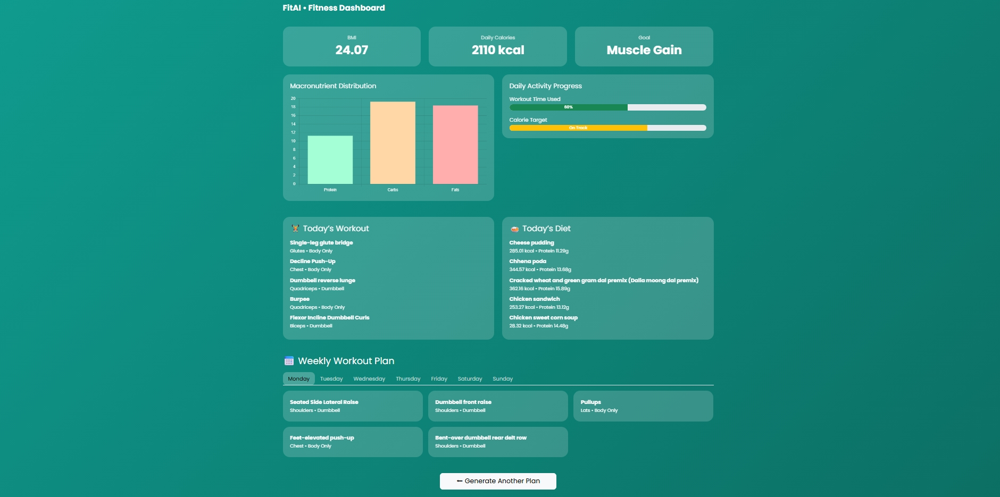

# AI-Based Personalized Workout and Diet Planner

This project is an AI-powered fitness recommendation system designed to generate personalized workout and diet plans for students. It addresses the limitations of generic fitness applications by considering individual body metrics, lifestyle constraints, equipment availability, budget, and Indian food habits.

The system combines machine learning with rule-based personalization to ensure that all recommendations are practical, realistic, and easy to follow.

---

## Problem Statement

Most fitness applications provide one-size-fits-all workout and diet plans. These generic plans often fail to account for differences in body composition, calorie requirements, available workout time, cultural dietary preferences, and access to fitness equipment.

This project aims to solve this problem by building an AI-driven system that delivers customized fitness plans tailored specifically for students.

---

## Project Objectives

The main objectives of this project are to personalize workout and diet plans, apply machine learning instead of fully hardcoded logic, and ensure recommendations remain practical and budget-friendly. The system supports Indian vegetarian and non-vegetarian diets, respects equipment availability, and provides both daily and weekly fitness planning through an interactive dashboard.

---

## Machine Learning Approach

The project uses K-Means clustering, an unsupervised machine learning algorithm, to group students with similar fitness profiles. Since there is no labeled data defining an ideal fitness plan, unsupervised learning is the most suitable approach.

Clustering is performed using BMI, daily calorie requirements, and time available for exercise. Based on the resulting cluster, a high-level fitness strategy is selected.

A hybrid AI approach is used in which machine learning determines the strategy, while rule-based logic enforces real-world constraints such as equipment availability, diet preference, and practicality.

---

## System Architecture

User inputs are processed to calculate BMI and daily calorie requirements. These features are passed to the K-Means clustering model to identify a fitness group. Based on the identified cluster, personalized workout and diet plans are generated and displayed through a web-based dashboard.

---

## Features

- Personalized daily workout plans  
- Personalized daily diet plans  
- Structured weekly workout schedule with rest days  
- Equipment-aware recommendations  
- Indian vegetarian and non-vegetarian diet support  
- Interactive dashboard with charts and progress indicators  

---

## Application Screenshots

### Home Page

### Dashboard View
.png)

---

## Datasets Used

The project uses an Indian food nutrition dataset containing calorie and macronutrient information for diet planning. A gym exercise dataset provides exercise names, muscle groups, and equipment details for workout recommendations. A synthetic student fitness dataset is used for clustering students based on BMI, calorie needs, and time availability.

---

## Technology Stack

- Backend: Python, Flask  
- Machine Learning: scikit-learn (K-Means)  
- Data Processing: Pandas, NumPy  
- Frontend: HTML, CSS, Bootstrap  
- Visualization: Chart.js  

---

## How to Run the Project Locally

1. Clone the repository from GitHub  
2. Navigate into the project directory  
3. Install dependencies using `requirements.txt`  
4. Run the Flask application  
5. Open the local server URL in a web browser  

---

## Future Scope

Future enhancements include user feedback-based learning, medical condition-aware recommendations, mobile application development, integration with wearable devices, and an AI-based fitness chatbot.

---

## Academic Relevance

This project demonstrates practical application of unsupervised machine learning, hybrid AI system design, and end-to-end development of an AI-based web application. It is suitable for final year project submission, viva examinations, and internship portfolios.

---

## Author

Aditya P Bhat 

AI and Machine Learning Enthusiast
